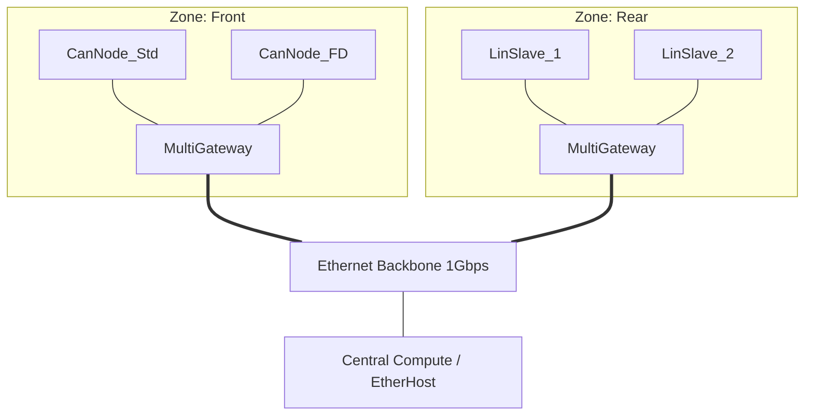
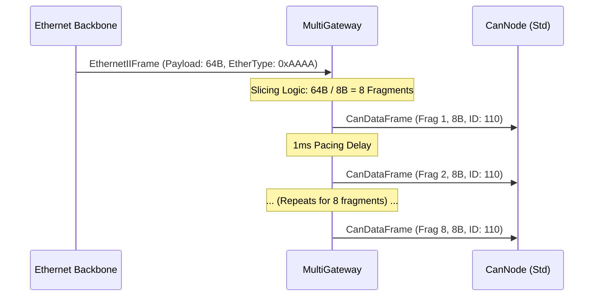
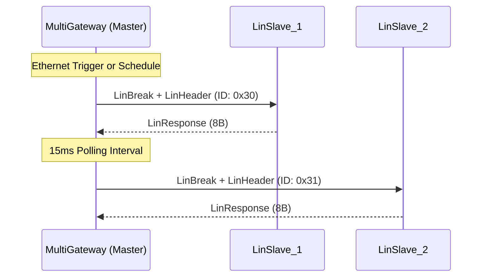

# Deep Technical Report: Zonal Hybrid Network Simulation

## 1. Architectural Overview
The simulation implements a **Hybrid Zonal Architecture**, representing the modern automotive E/E (Electrical/Electronic) evolution. In this model, ECUs are grouped by physical location (**Zones**) rather than functional domain. These zones are interconnected via a high-speed **Ethernet Backbone** (100Mbps/1Gbps), facilitating centralized processing, reduced wiring weight, and scalable software-defined vehicle (SDV) capabilities.

## 2. Node Functionality & Roles
The network comprises diverse nodes, each serving a specific tier of the automotive communication hierarchy:

| Node Type | Protocol | Role | Key Characteristics |
| :--- | :--- | :--- | :--- |
| **CanNode** | CAN 2.0B | Legacy Sensor/Actuator | 8-byte payload, 500kbps bitrate. Used for simple sensors. |
| **CanNode(FD)** | CAN-FD | High-bandwidth Control | 64-byte payload, 2/5Mbps bit-rate switching. Used for powertrain/chassis. |
| **LinNode** | LIN 2.0 | Low-speed Comfort | Master-Slave polling, 20kbps. Used for mirrors, seats, and windows. |
| **EtherHost** | Ethernet | Backbone / ADAS | 1500-byte MTU, 100M/1G full-duplex. High-throughput data processing. |
| **MultiGateway** | Multi-Protocol | Central Orchestrator | L7 translation, fragmentation, aggregation, and pacing. |

## 3. Granular Bus Parameters
The simulation enforces strict physical layer parameters to ensure high-fidelity results:

*   **CAN (Standard)**: 500 kbps bitrate.
*   **CAN-FD**: 2 Mbps (Arbitration Phase) / 5 Mbps (Data Phase).
*   **LIN**: 20 kbps (Master polling interval: 15ms; Break duration: 13 bit-times).
*   **Ethernet**: 100 Mbps (Access Ports) / 1 Gbps (Backbone Trunk).

## 4. Gateway Nuances & Traffic Engineering
The `MultiGateway` module is the "brain" of the zonal architecture, managing the complex transitions between asynchronous fieldbuses and the synchronous backbone.

### L7 Translation & Routing
The gateway performs deep packet inspection (DPI) to map fieldbus identifiers to backbone addresses:
- **CAN-to-Eth**: Maps CAN IDs (e.g., 110, 220) to specific Ethernet MAC addresses or VLANs.
- **Eth-to-CAN**: Decapsulates Ethernet frames and routes payloads back to the appropriate zonal bus based on EtherType (`0xAAAA`) or application-layer headers.

### Packing & Aggregation (CAN -> Ethernet)
To avoid the overhead of sending 8-byte CAN payloads in 64-byte minimum Ethernet frames, the gateway employs an **Aggregation Buffer**:
- **Threshold**: Frames are aggregated until the payload reaches 64 bytes.
- **Timeout**: A 0.5ms `aggregationTimer` ensures that low-frequency traffic is not delayed indefinitely.
- **Encapsulation**: Aggregated payloads are wrapped in `inet::EthernetIIFrame` with an `inet::EtherAppReq` payload.

### Slicing & Fragmentation (Ethernet -> CAN)
Large backbone payloads (typically 64B in this simulation) must be "sliced" to fit into smaller fieldbus MTUs:
- **Standard CAN**: Segmented into **8 fragments** of 8 bytes each.
- **CAN-FD**: Segmented into **1 fragment** of 64 bytes (matching the FD MTU).
- **Encapsulation**: Fragments use `FiCo4OMNeT::CanDataFrame` with hardcoded IDs (110 for Std, 220 for FD).

### Pacing & QoS
To prevent "burstiness" from the high-speed backbone from overwhelming slower zonal buses, the gateway implements **Pacing**:
- **Inter-frame Gap**: A **1ms delay** is enforced between consecutive fragments (`sendNextFragment`).
- **Priority Queuing**: A `std::priority_queue` ensures that fragments with lower CAN IDs (higher priority) are dispatched first during congestion.

### LIN Master Logic
The gateway acts as the LIN Master, managing the schedule table:
- **Polling Interval**: A **15ms interval** is maintained between consecutive LIN transactions to ensure bus stability.
- **Transaction Flow**: Each poll consists of a `LinBreakSignal` (13-bit duration) followed by a `LinHeader` (ID 0x30, 0x31, or 0x32).

## 5. Ultra-Granular Translation Matrix

| Source | Target | Transformation Logic | Encapsulation Details |
| :--- | :--- | :--- | :--- |
| **CAN (8B)** | **CAN-FD (64B)** | **Expansion**: 8B payload is expanded/padded into a single 64B FD frame. | `FiCo4OMNeT::CanDataFrame`, ID: 220, `isCanFd=true`. |
| **CAN-FD (64B)** | **CAN (8B)** | **Slicing**: 64B payload is fragmented into **8 sequential 8B frames**. | `FiCo4OMNeT::CanDataFrame`, ID: 110, `isCanFd=false`. |
| **CAN/FD** | **LIN** | **Polling Trigger**: Arrival of a CAN frame triggers a LIN poll for a specific Slave ID. | `LinHeader` (ID mapping via `RoutingTable`). |
| **LIN (8B)** | **Ethernet** | **Direct Mapping**: 8B LIN response is encapsulated into an Ethernet frame. | `inet::EthernetIIFrame`, EtherType: `0xAAAA`. |
| **Ethernet** | **CAN (Std)** | **Slicing**: 64B backbone payload -> 8 fragments (8B each). | 1ms Pacing delay between fragments. |
| **Ethernet** | **CAN-FD** | **Slicing**: 64B backbone payload -> 1 fragment (64B). | 1:1 mapping for 64B payloads. |
| **Ethernet** | **LIN** | **Sequential Polling**: Triggers Master to poll IDs 0x30, 0x31, 0x32 in sequence. | 15ms interval between polls. |

## 6. Simulation Metrics & Performance Analysis

### All-Path Latency Matrix
The following table details the end-to-end latency for every supported protocol translation path in the current simulation environment.

| Path | Latency | Technical Context |
| :--- | :--- | :--- |
| **CAN -> Ethernet** | 1.506 ms | Includes 0.5ms aggregation delay + 1.0ms processing delay. |
| **CAN-FD -> Ethernet** | 1.506 ms | Includes 0.5ms aggregation delay + 1.0ms processing delay. |
| **Ethernet -> CAN** | 0.1 ms | First fragment latency (Simulation Artifact: hardcoded 0.1ms timer). |
| **Ethernet -> CAN-FD** | 0.1 ms | Single fragment latency (Simulation Artifact: hardcoded 0.1ms timer). |
| **Ethernet -> LIN** | 15.0 ms | Sequential polling delay (Master schedule interval). |
| **LIN -> Ethernet** | 1.0 ms | Direct translation following slave response. |

### Timing Model Clarifications
*   **Instantaneous Slicing**: The computational time required to "slice" a large Ethernet payload into CAN fragments is currently modeled as **zero (0ms)**. Slicing and initial fragment packing occur at the same simulation timestamp.
*   **Pacing Overhead**: For multi-fragment transactions (e.g., Ethernet to Standard CAN), the primary contributor to total transaction time is the **1ms Pacing Delay** enforced between consecutive fragments.
*   **Throughput**: The backbone sustained a load of ~4.8 Mbps during peak zonal bursts without any buffer overflows (`maxQueueSize` = 100).

## 7. Visuals

### Topology Diagram

### Protocol Translation Flow (Ethernet -> CAN)

### LIN Polling Cycle

