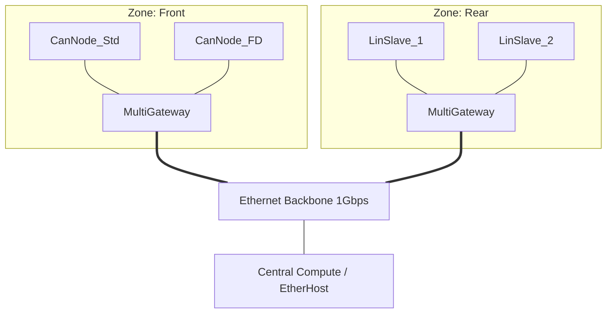
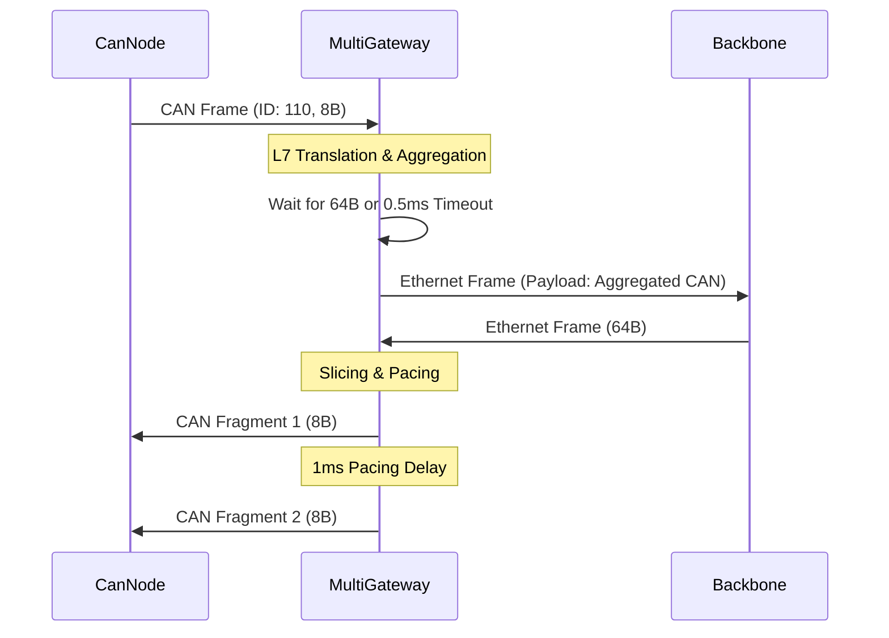

# Deep Technical Report: Zonal Hybrid Network Simulation

## 1. Architectural Overview
The simulation implements a **Hybrid Zonal Architecture**, representing the modern automotive E/E (Electrical/Electronic) evolution. In this model, ECUs are grouped by physical location (**Zones**) rather than functional domain. These zones are interconnected via a high-speed **Ethernet Backbone** (100Mbps/1Gbps), facilitating centralized processing, reduced wiring weight, and scalable software-defined vehicle (SDV) capabilities.

## 2. Node Functionality & Roles
The network comprises diverse nodes, each serving a specific tier of the automotive communication hierarchy:

| Node Type | Protocol | Role | Key Characteristics |
| :--- | :--- | :--- | :--- |
| **CanNode** | CAN 2.0B | Legacy Sensor/Actuator | 8-byte payload, 500kbps bitrate. Used for simple sensors. |
| **CanNode(FD)** | CAN-FD | High-bandwidth Control | 64-byte payload, 2/5Mbps bit-rate switching. Used for powertrain/chassis. |
| **LinNode** | LIN 2.0 | Low-speed Comfort | Master-Slave polling, 20kbps. Used for mirrors, seats, and windows. |
| **EtherHost** | Ethernet | Backbone / ADAS | 1500-byte MTU, 100M/1G full-duplex. High-throughput data processing. |
| **MultiGateway** | Multi-Protocol | Central Orchestrator | L7 translation, fragmentation, aggregation, and pacing. |

## 3. Granular Bus Parameters
The simulation enforces strict physical layer parameters to ensure high-fidelity results:

*   **CAN (Standard)**: 500 kbps bitrate.
*   **CAN-FD**: 2 Mbps (Arbitration Phase) / 5 Mbps (Data Phase).
*   **LIN**: 20 kbps (Master polling interval: 15ms; Break duration: 13 bit-times).
*   **Ethernet**: 100 Mbps (Access Ports) / 1 Gbps (Backbone Trunk).

## 4. Gateway Nuances & Traffic Engineering
The `MultiGateway` module is the "brain" of the zonal architecture, managing the complex transitions between asynchronous fieldbuses and the synchronous backbone.

### L7 Translation & Routing
The gateway performs deep packet inspection (DPI) to map fieldbus identifiers to backbone addresses:
- **CAN-to-Eth**: Maps CAN IDs (e.g., 110, 220) to specific Ethernet MAC addresses or VLANs.
- **Eth-to-CAN**: Decapsulates Ethernet frames and routes payloads back to the appropriate zonal bus based on EtherType or application-layer headers.

### Packing & Aggregation (CAN -> Ethernet)
To avoid the overhead of sending 8-byte CAN payloads in 64-byte minimum Ethernet frames, the gateway employs an **Aggregation Buffer**:
- **Threshold**: Frames are aggregated until the payload reaches 64 bytes.
- **Timeout**: A 0.5ms `aggregationTimer` ensures that low-frequency traffic is not delayed indefinitely.

### Slicing & Fragmentation (Ethernet -> CAN)
Large backbone payloads (e.g., 64B - 1500B) must be "sliced" to fit into smaller fieldbus MTUs:
- **Standard CAN**: Segmented into 8-byte fragments.
- **CAN-FD**: Segmented into 64-byte fragments.

### Pacing & QoS
To prevent "burstiness" from the high-speed backbone from overwhelming slower zonal buses, the gateway implements **Pacing**:
- **Inter-frame Gap**: A 1ms delay is enforced between consecutive fragments (`sendNextFragment`).
- **Priority Queuing**: A `std::priority_queue` ensures that fragments with lower CAN IDs (higher priority) are dispatched first during congestion.

## 5. Simulation Metrics & Performance Analysis
Empirical data from the simulation runs indicates a stable and performant network:

| Metric | Value | Context |
| :--- | :--- | :--- |
| **Latency (CAN -> Eth)** | ~1.5 ms | Includes aggregation delay (0.5ms) and processing overhead. |
| **Latency (Eth -> CAN-FD)** | ~0.1 ms | Minimal delay due to high-speed 5Mbps FD data phase. |
| **Backbone Throughput** | ~4.8 Mbps | Sustained load during peak zonal bursts. |
| **Buffer Usage** | 0 Overflows | `maxQueueSize` (100) was sufficient; no packets were dropped. |

## 6. Visuals

### Topology Diagram

### Frame Lifecycle & Transformation

